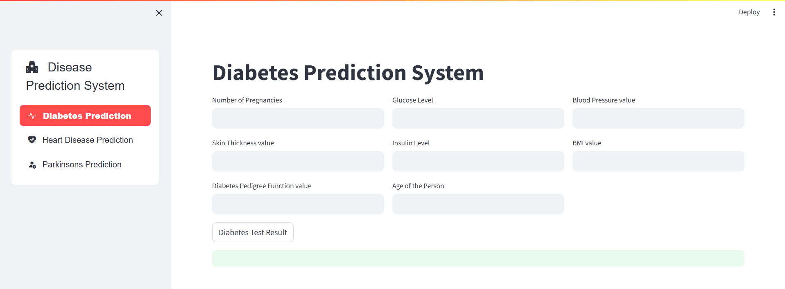
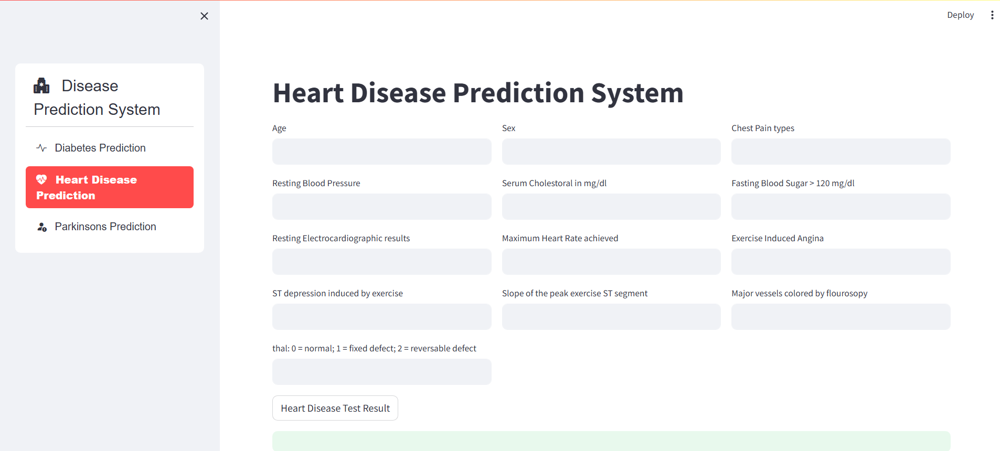
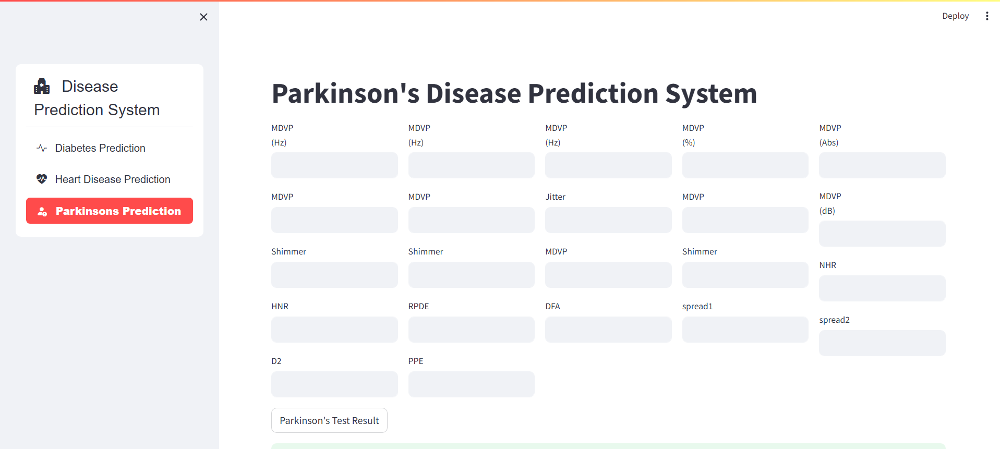

# Multiple Disease Prediction

## Overview

This project implements different Machine Learning algorithms to predict different diseases such as Diabetes , Heart Disease and Parkinsons Disease.

## Requirements

- Python 3
- NumPy
- Pandas
- scikit-learn
- Streamlit

## Usage

1. Clone the repository:

```
git clone https://github.com/srijosh/Plant-Disease-CNN-Classifier.git
```

2. Install the required dependencies:

```
pip install -r requirements.txt
```

3. Run the streamlit app

```
streamlit run app.py
```

## Demo:

<table width="100%"> 
<tr>
<td>

</td> 
<td>
  
</td>
<td>
  
</td>
</table>

## Kaggle Datasets Link:

## Dataset for Diabetes:

https://www.kaggle.com/datasets/uciml/pima-indians-diabetes-database

## Dataset for Heart Disease:

https://www.kaggle.com/datasets/priyanka841/heart-disease-prediction-uci/data

## Dataset for Parkinsons Disease:

https://www.kaggle.com/datasets/naveenkumar20bps1137/parkinsons-disease-detection/data
